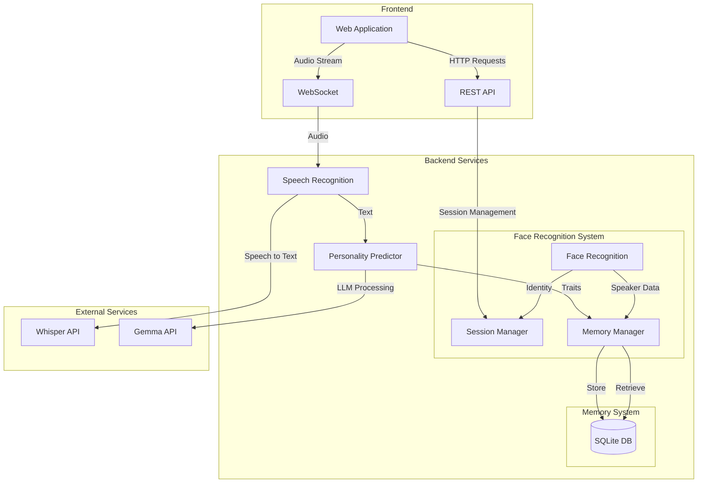
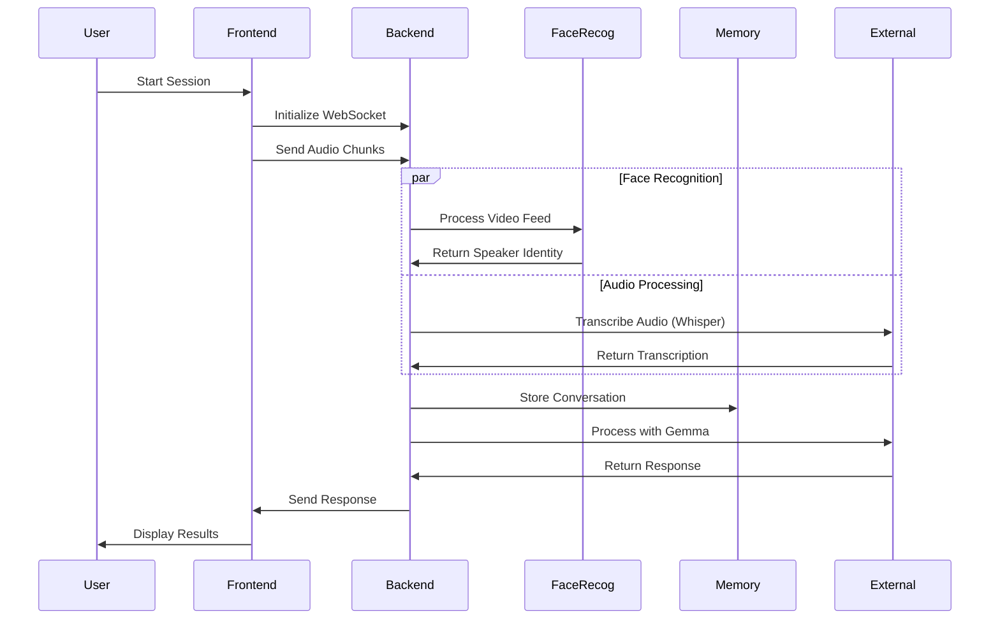
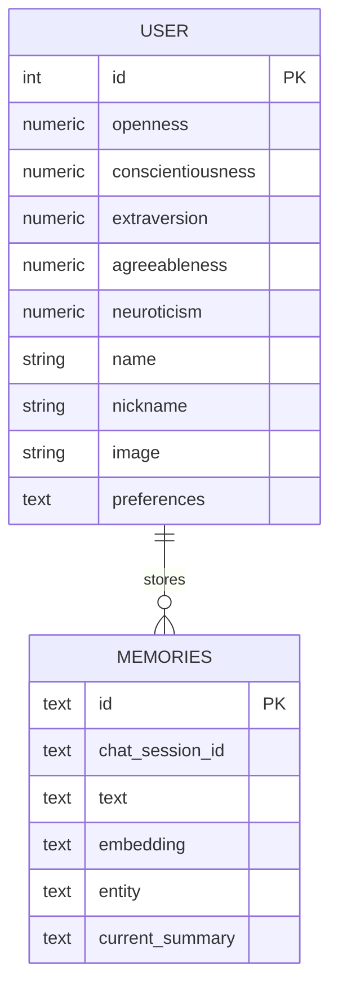

# Voice Enhancement and Memory Management Relay System
> A sophisticated voice enhancement and memory management system developed during a hackathon, designed to improve conversational agent interactions through voice isolation, speaker recognition, and contextual memory management.

## System Architecture



## Data Flow



## Component Overview

### 1. Frontend (`/frontend`)
- React-based web application
- Real-time audio streaming capabilities
- WebSocket integration for continuous communication
- User interface for interaction visualization

### 2. Face Recognition System
Three main components:

#### a. Basic GUI (`face_recog_GUI.py`)
- Real-time face detection
- Lip movement tracking
- Basic visualization interface

#### b. Named GUI (`face_recog_names_GUI.py`)
- Enhanced version with name recognition
- Pre-assigned user identification
- Full-screen display capabilities

#### c. Core Recognition (`facial_recognition.py`)
- Face embedding generation
- Speaker identification
- Database integration for user profiles

### 3. Relay System (`relay.py`)
Core functionalities:
- WebSocket server management
- Audio processing pipeline
- Memory management
- API endpoint handling
- Real-time transcription
- Personality prediction
- Session management

## Database Schema



## Key Features

1. **Voice Enhancement**
   - Background noise reduction
   - Main speaker isolation
   - Multi-speaker differentiation

2. **Face Recognition**
   - Real-time face detection
   - Lip movement tracking
   - Speaker identification
   - User profile management

3. **Memory Management**
   - Conversation history storage
   - Contextual memory retrieval
   - User preference tracking
   - Personality trait analysis

4. **Real-time Processing**
   - Continuous audio streaming
   - WebSocket communication
   - Parallel processing of video and audio
   - Low-latency response generation

## Technical Stack

- **Frontend**: React, WebSocket API
- **Backend**: Flask, SQLAlchemy
- **AI/ML**: 
  - Face Recognition: MediaPipe, InsightFace
  - Speech Recognition: Whisper
  - Text Processing: Gemma, spaCy
- **Database**: SQLite
- **External APIs**: OpenAI, Gemma

## Process Flowcharts

### 1. Main System Flow

```
                                    +-------------------+
                                    |  Start System     |
                                    +-------------------+
                                            |
                                            v
                                    +-----------------+
                                    | Check Camera    |
                                    | Availability    |
                                    +-----------------+
                                            |
                    +------------------------+------------------------+
                    |                        |                       |
                    v                        v                       v
            +-------------+          +--------------+        +--------------+
            |  Initialize  |          | Start Face   |        | Initialize   |
            |  WebSocket   |          | Recognition  |        | Audio System |
            +-------------+          +--------------+        +--------------+
                    |                        |                       |
                    |                        |                       |
                    v                        v                       v
            +-------------+          +--------------+        +--------------+
            |   Process    |          |   Process    |        |   Process    |
            |   Audio      |--------->|   Video      |------->|   Response   |
            +-------------+          +--------------+        +--------------+
```

### 2. Face Recognition Pipeline
```
    +---------------+     +-----------------+     +------------------+
    |  Video Input  |---->| Frame Analysis |---->| Face Detection   |
    +---------------+     +-----------------+     +------------------+
                                                          |
                                                          v
    +---------------+     +-----------------+     +------------------+
    | User Profile  |<----| Face Matching  |<----| Feature Extract  |
    +---------------+     +-----------------+     +------------------+
           |                      ^                       |
           |                      |                       |
           v                      |                       v
    +---------------+     +-----------------+     +------------------+
    |  Store Data   |     | Lip Movement   |<----| Track Landmarks  |
    +---------------+     | Detection       |     +------------------+
                         +-----------------+
```

### 3. Audio Processing Pipeline
```
    [Audio Input] 
         |
         v
    [500ms Chunks]------------------+
         |                          |
         v                          v
    [Whisper STT]            [Voice Analysis]
         |                          |
         v                          v
    [Text Output]            [Speaker Detection]
         |                          |
         +------------+-------------+
                     v
              [Memory System]
                     |
                     v
            [Response Generation]
                     |
                     v
              [Text to Speech]
                     |
                     v
            [Output to Speaker]
```

### 4. Memory Management System
```
    +------------------+
    | New Conversation |
    +------------------+
            |
    +-------v--------+     +------------------+
    | Text Analysis  |---->| Entity Extraction|
    +---------------+      +------------------+
            |                       |
    +-------v--------+     +-------v----------+
    | Generate       |     | Update User      |
    | Embedding     |     | Preferences      |
    +---------------+     +------------------+
            |                       |
    +-------v--------+     +-------v----------+
    | Store in       |<----| Update Memory    |
    | Database      |     | Summary         |
    +---------------+     +------------------+
```

### 5. Real-time Data Flow
```
    User Input
    |
    +-> Audio Stream -----> Buffer -------> Whisper -----> Text Analysis
    |                                                            |
    +-> Video Stream -----> Face Detection --> Lip Tracking     |
                                |                   |           |
                                v                   v           v
                            Identity -----> Speaking Status -> Memory
                                                                |
                                                                v
                                                          Response Gen
                                                                |
                                                                v
                                                          Text to Speech
                                                                |
                                                                v
                                                            Output
```

